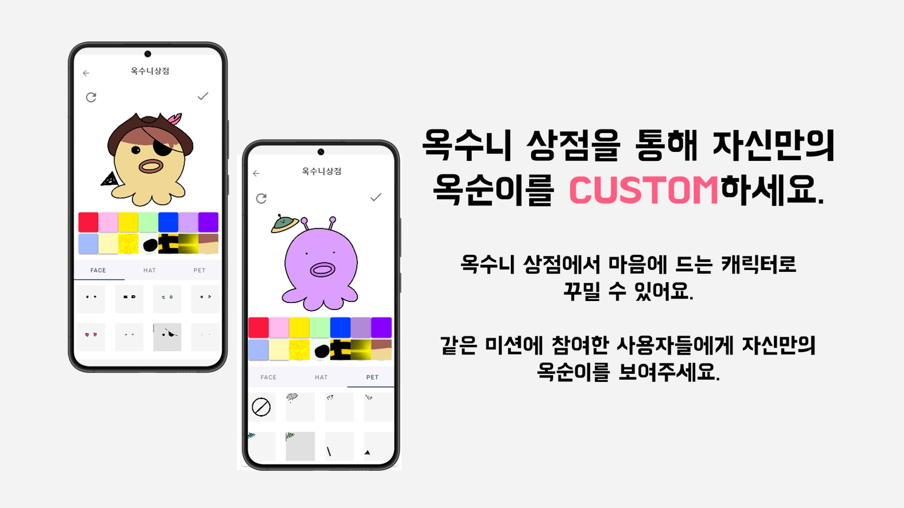

 

 

# 🐙 OctopUS 🐙

-  SSAFY 7기 서울 공통 7반 A702 공통 프로젝트입니다.

      

## 📆 프로젝트 기간

-  2022년 07월 05일 ~ 2022년 08월 19일
   
      

## 🛠 만든사람

- #### **배현중**(팀장/프론트엔드) [@hbae](https://github.com/hbae)
- #### **김수미**(팀원/프론트엔드) [@soomi1015](https://github.com/soomi1015)
- #### **박예인**(팀원/백엔드) [@iasfk](https://github.com/iasfk)
- #### **박지수**(팀원/백엔드) [@lapaho8645](https://github.com/lapaho8645)
- #### **박종찬**(팀원/백엔드) [@jjong0416](https://github.com/jjong0416)
- #### **이경준**(팀원/백엔드) [@K15-1](https://github.com/K15-1)
   

## 💻 기술 스택
 
</img>
</img>
 
</img>
 
</img>
</img>
</img>
</img>
 
 
 

## 💻 협업툴
 

 

### <a href="https://jjongdev.notion.site/OctopUS-040789f552d24058b076c0dcbd4ea4af"> 🐙Octopus 노션 링크 </a>

   

## ⚙ 시스템 아키텍쳐

   
   

   

## ⚙ 프로젝트 상세 설명

 

   
    

## 🖥실행화면

 

### 회원가입하기

 

### 새로운 미션 만들기

 

### 미션 조회 및 참여

 

### 진행중인 미션에 인증하기

 

### 포인트

 

### 캐릭터(옥순이) 꾸미기

 